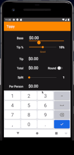

# Tip Calculator 

## *Dean Stratakos*

**Tippy** computes the tip and total amount for a bill. The app uses the base amount and tip percentage to calculate the amount owed, and it also describes the quality of service based on the tip.

Time spent: **18** hours spent in total

## Functionality 

The following **required** functionality is completed:

* [x] User can enter in a bill amount (total amount to tip on)
* [x] User can enter a tip percentage (what % the user wants to tip).
* [x] The tip and total amount are updated immediately when any of the inputs changes.
* [x] The user sees a label or color update based on the tip amount. 

The following **extensions** are implemented:

* [x] A second screen allows the user to see their payment history.
    * [x] Two buttons on the main screen let the user save the current payment and view the past history.
* [x] The total amount can be rounded up to the nearest dollar.
    * [x] Doing so will recompute the tip amount and tip percentage based on the rounded total.
    * [x] Tapping the round switch again will restore the total based on the original tip percentage.
    * [x] Editing the base amount or tip percentage manually will reset the round switch to the default.
* [x] Users have the ability to split the bill among 1-15 people.
    * [x] Changing the split updates the Per Person cost immediately.
* [x] The base view starts at $0.00 and updates with user input, keeping the currency formatting. E.g. $0.00 -> $0.09 -> $0.95 -> $9.53.
    * [x] The default values for base, tip, total, and per person are $0.00.
* [x] The keyboard hides when the user interacts with the progress bars.
* [x] The app has a custom color scheme.

## Video Walkthrough

Here's a walkthrough of implemented user stories:

## Notes

The main challenges when building this app occurred when implementing the second activity, or screen, that allows users to view their payment history. I spent time conceptualizing how I would build, store, and update my data structure to store payment objects. After I had created the data strucutre, I had to figure out how to pass the information from the main screen to the history screen. This exercise was a great opportunity for me to learn about intents, which communicate between multiple activities and allow data to be transferred from one activity to another.

Furthermore, I implemented a RecyclerView to display the list of payments, which presented its own set of challenges. In doing so, I created an adapter for the recycler as well as a separate .xml file to format a single view element within the list.

With more time, I would implement persistence so that information could be stored indefinitely. A simple solution would be to use a local file whereas more involved solutions would use either a local SQLite or a remote Firebase database.

## License

    Copyright [2020] [Dean Stratakos]

    Licensed under the Apache License, Version 2.0 (the "License");
    you may not use this file except in compliance with the License.
    You may obtain a copy of the License at

        http://www.apache.org/licenses/LICENSE-2.0

    Unless required by applicable law or agreed to in writing, software
    distributed under the License is distributed on an "AS IS" BASIS,
    WITHOUT WARRANTIES OR CONDITIONS OF ANY KIND, either express or implied.
    See the License for the specific language governing permissions and
    limitations under the License.
